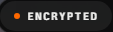
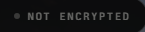
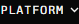
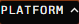
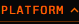

# aetheris Design System

You are building UI for **aetheris**. Light-themed, warm palette, sans-serif typography (archivo), compact density on a 4px grid, expressive motion.

## Visual Reference

**IMPORTANT**: Study ALL screenshots below before writing any UI. Match colors, typography, spacing, layout, and motion exactly as shown.

### Homepage


### Scroll Journey (Cinematic Visual States)

> These screenshots capture the website at different scroll depths. The design changes dramatically as you scroll — each frame shows a different cinematic state. Replicate these exact visual transitions.

#### 0% — Hero / Above the fold


#### 17% — Mid-page at 17% scroll


#### 33% — Mid-page at 33% scroll


#### 50% — Mid-page at 50% scroll


#### 67% — Mid-page at 67% scroll


#### 83% — Mid-page at 83% scroll


#### 100% — Footer / End of page


> Read `references/DESIGN.md` for full token details. Read `references/ANIMATIONS.md` for motion specs. Read `references/LAYOUT.md` for layout structure. Read `references/COMPONENTS.md` for component patterns.

## Ultra Reference Files

This package includes extended documentation. **Read these files before implementing:**

| File | Contents |
|------|----------|
| `references/DESIGN.md` | Full design system tokens, colors, typography, spacing |
| `references/VISUAL_GUIDE.md` | **START HERE** — Master visual guide with all screenshots embedded |
| `references/ANIMATIONS.md` | CSS keyframes, scroll triggers, motion library stack, video specs |
| `references/LAYOUT.md` | Flex/grid containers, page structure, spacing relationships |
| `references/COMPONENTS.md` | DOM component patterns, HTML structure, class fingerprints |
| `references/INTERACTIONS.md` | Hover/focus states with before/after style diffs |
| `screens/scroll/` | 7 scroll journey screenshots showing cinematic states |

### Animation Stack Detected

- **Web Animations API (13 active)** — animation

## Design Philosophy

- **Layered depth** — use shadow tokens to create a sense of physical layering. Each elevation level has a specific shadow.
- **Gradient accents** — gradients are used thoughtfully for emphasis, not decoration.
- **Type pairing** — archivo for body/UI text, darkerGrotesque for headings/display. Never introduce a third typeface.
- **compact density** — 4px base grid. Every dimension is a multiple of 4.
- **warm palette** — the color temperature runs warm, matching the sans-serif typography.
- **Restrained accent** — `#ff691f` is the only pop of color. Used exclusively for CTAs, links, focus rings, and active states.
- **Expressive motion** — animations are an integral part of the experience. Use spring physics and layout animations.

## Color System

### Core Palette

| Role | Token | Hex | Use |
|------|-------|-----|-----|
| Background | `--background` | `#ffffff` | Page/app background |
| Surface | `--surface` | `#f2f2f0` | Cards, panels, modals |
| Text Primary | `--text-primary` | `#080808` | Headings, body text |
| Text Muted | `--text-muted` | `#666664` | Captions, placeholders |
| Accent | `--accent` | `#ff691f` | CTAs, links, focus rings |
| Border | `--border` | `#4a4a49` | Dividers, card borders |

### Status Colors

| Status | Hex | Use |
|--------|-----|-----|
| Success | `#00bb7f` | Confirmations, positive trends |
| Warning | `#f99c00` | Caution states, pending items |
| Danger | `#ff6901` | Errors, destructive actions |

### Extended Palette

- `#cfcfcb`
- `#c4c4c0`
- `#585857`
- `#1f2326`
- `#dededb`
- **color-red-400:** `#ff6568`
- **color-sky-500:** `#00a5ef`
- **primary-foreground:** `#190f0b` — Deep background layer or shadow color

### CSS Variable Tokens

```css
--background: #070707;
--foreground: #f5f5f5;
--card: #161616;
--card-foreground: #f5f5f5;
--popover: #161616;
--popover-foreground: #f5f5f5;
--primary: #ff691f;
--primary-foreground: #190f0b;
--secondary: #222;
--secondary-foreground: #f5f5f5;
--muted: #222;
--muted-foreground: #9e9e9e;
--accent: #222;
--accent-foreground: #f5f5f5;
--destructive: #ff6568;
--border: #ffffff1f;
--sidebar-foreground: #f5f5f5;
--sidebar-primary: #ff691f;
--sidebar-primary-foreground: #190f0b;
--sidebar-accent: #222;
```

## Typography

### Font Stack

- **archivo** — Heading 1, Heading 2, Heading 3
- **darkerGrotesque** — Body, Caption
- **berkeleyMono** — Code

### Font Sources

```css
@font-face {
  font-family: "darkerGrotesque";
  src: url("fonts/darkerGrotesque-500.woff2") format("woff2");
  font-weight: 500;
}
@font-face {
  font-family: "archivo";
  src: url("fonts/archivo-500.woff2") format("woff2");
  font-weight: 500;
}
@font-face {
  font-family: "berkeleyMono";
  src: url("fonts/berkeleyMono-Regular.woff2") format("woff2");
  font-weight: 400;
}
@font-face {
  font-family: "berkeleyMono";
  src: url("fonts/berkeleyMono-700.woff2") format("woff2");
  font-weight: 700;
}
@font-face {
  font-family: "berkeleyMonoNumerals";
  src: url("fonts/berkeleyMonoNumerals-Regular.woff2") format("woff2");
  font-weight: 400;
}
@font-face {
  font-family: "berkeleyMonoNumerals";
  src: url("fonts/berkeleyMonoNumerals-700.woff2") format("woff2");
  font-weight: 700;
}
@font-face {
  font-family: "berkeleyMonoNumeralsDisplay";
  src: url("fonts/berkeleyMonoNumeralsDisplay-Regular.woff2") format("woff2");
  font-weight: 400;
}
@font-face {
  font-family: "berkeleyMonoNumeralsDisplay";
  src: url("fonts/berkeleyMonoNumeralsDisplay-700.woff2") format("woff2");
  font-weight: 700;
}
```

### Type Scale

| Role | Family | Size | Weight |
|------|--------|------|--------|
| Heading 1 | archivo | 2.5rem | 700 |
| Heading 2 | archivo | 2.375rem | 700 |
| Heading 3 | archivo | clamp(2rem,7.1cqw,5rem) | 700 |
| Body | darkerGrotesque | .6875rem | 400 |
| Caption | darkerGrotesque | 11px | 400 |
| Code | berkeleyMono | 14px | 400 |

### Typography Rules

- Body/UI: **archivo**, Headings: **darkerGrotesque** — these are the only display fonts
- Max 3-4 font sizes per screen
- Headings: weight 600-700, body: weight 400
- Use color and opacity for text hierarchy, not additional font sizes
- Line height: 1.5 for body, 1.2 for headings

## Spacing & Layout

### Base Grid: 4px

Every dimension (margin, padding, gap, width, height) must be a multiple of **4px**.

### Spacing Scale

`2, 4, 6, 8, 10, 12, 14, 16, 18, 20, 22, 24` px

### Spacing as Meaning

| Spacing | Use |
|---------|-----|
| 4-8px | Tight: related items (icon + label, avatar + name) |
| 12-16px | Medium: between groups within a section |
| 24-32px | Wide: between distinct sections |
| 48px+ | Vast: major page section breaks |

### Border Radius

Scale: `.25rem, 6px, 10px, 12px, 999px, 999rem`
Default: `12px`

### Container

Max-width: `1024px`, centered with auto margins.

### Breakpoints

| Name | Value |
|------|-------|
| xs | 22.5rem |
| sm | 40rem |
| md | 48rem |
| lg | 56.3125rem |
| lg | 64rem |
| xl | 80rem |
| 2xl | 96rem |
| 2xl | 100rem |
| sm | 620px |
| sm | 640px |
| md | 768px |
| lg | 900px |
| lg | 1000px |
| lg | 1024px |
| xl | 1080px |
| xl | 1100px |
| xl | 1200px |

Mobile-first: design for small screens, layer on responsive overrides.

## Component Patterns

### Card

```css
.card {
  background: #f2f2f0;
  border: 1px solid #4a4a49;
  border-radius: 12px;
  padding: 16px;
  box-shadow: 0 0#ff690199;
}
```

```html
<div class="card">
  <h3>Card Title</h3>
  <p>Card content goes here.</p>
</div>
```

### Button

```css
/* Primary */
.btn-primary {
  background: #ff691f;
  color: #080808;
  border-radius: 12px;
  padding: 8px 16px;
  font-weight: 500;
  transition: opacity 150ms ease;
}
.btn-primary:hover { opacity: 0.9; }

/* Ghost */
.btn-ghost {
  background: transparent;
  border: 1px solid #4a4a49;
  color: #080808;
  border-radius: 12px;
  padding: 8px 16px;
}
```

```html
<button class="btn-primary">Get Started</button>
<button class="btn-ghost">Learn More</button>
```

### Input

```css
.input {
  background: #ffffff;
  border: 1px solid #4a4a49;
  border-radius: 12px;
  padding: 8px 12px;
  color: #080808;
  font-size: 14px;
}
.input:focus { border-color: #ff691f; outline: none; }
```

```html
<input class="input" type="text" placeholder="Search..." />
```

### Badge / Chip

```css
.badge {
  display: inline-flex;
  align-items: center;
  padding: 4px 8px;
  border-radius: 9999px;
  font-size: 12px;
  font-weight: 500;
  background: #f2f2f0;
  color: #666664;
}
```

```html
<span class="badge">New</span>
<span class="badge">Beta</span>
```

### Modal / Dialog

```css
.modal-backdrop { background: rgba(0, 0, 0, 0.6); }
.modal {
  background: #f2f2f0;
  border: 1px solid #4a4a49;
  border-radius: 999rem;
  padding: 24px;
  max-width: 480px;
  width: 90vw;
  box-shadow: 0 30px 70px -20px #000c;
}
```

```html
<div class="modal-backdrop">
  <div class="modal">
    <h2>Dialog Title</h2>
    <p>Dialog content.</p>
    <button class="btn-primary">Confirm</button>
    <button class="btn-ghost">Cancel</button>
  </div>
</div>
```

### Table

```css
.table { width: 100%; border-collapse: collapse; }
.table th {
  text-align: left;
  padding: 8px 12px;
  font-weight: 500;
  font-size: 12px;
  color: #666664;
  text-transform: uppercase;
  letter-spacing: 0.05em;
  border-bottom: 1px solid #4a4a49;
}
.table td {
  padding: 12px;
  border-bottom: 1px solid #4a4a49;
}
```

```html
<table class="table">
  <thead><tr><th>Name</th><th>Status</th><th>Date</th></tr></thead>
  <tbody>
    <tr><td>Item One</td><td>Active</td><td>Jan 1</td></tr>
    <tr><td>Item Two</td><td>Pending</td><td>Jan 2</td></tr>
  </tbody>
</table>
```

### Navigation

```css
.nav {
  display: flex;
  align-items: center;
  gap: 8px;
  padding: 12px 16px;
  border-bottom: 1px solid #4a4a49;
}
.nav-link {
  color: #666664;
  padding: 8px 12px;
  border-radius: 12px;
  transition: color 150ms;
}
.nav-link:hover { color: #080808; }
.nav-link.active { color: #ff691f; }
```

```html
<nav class="nav">
  <a href="/" class="nav-link active">Home</a>
  <a href="/about" class="nav-link">About</a>
  <a href="/pricing" class="nav-link">Pricing</a>
  <button class="btn-primary" style="margin-left: auto">Get Started</button>
</nav>
```

### Extracted Components

These components were found in the codebase:

**Button** (`html`)

**Input** (`html`)

**Card** (`html`)
- Variants: `motif`, `motif-compact`

## Page Structure

The following page sections were detected:

- **Navigation** — Top navigation bar (32 items)
- **Hero** — Hero/banner section with headline and CTAs
- **Footer** — Page footer with links and info (27 items)
- **Cta** — Call-to-action section
- **Stats** — Statistics/metrics display
- **Cards** — Grid of 8 card elements (8 items)
- **Faq** — FAQ/accordion section

When building pages, follow this section order and structure.

## Animation & Motion

This project uses **expressive motion**. Animations are part of the design language.

### CSS Animations

- `cellIn`
- `riseIn`
- `pulse`
- `aetherisFade`
- `blink`

### Motion Tokens

- **Duration scale:** `0ms`, `.15s`, `.2s`, `.3s`, `.5s`, `.7s`, `50ms`, `150ms`, `180ms`, `200ms`, `220ms`, `250ms`, `300ms`, `350ms`, `400ms`, `500ms`, `900ms`
- **Easing functions:** `cubic-bezier(.22,1,.36,1)`, `ease-out`, `ease-in-out`, `linear`
- **Animated properties:** `opacity`, `transform`

### Motion Guidelines

- **Duration:** Use values from the duration scale above. Short (0ms) for micro-interactions, long (900ms) for page transitions
- **Easing:** Use `cubic-bezier(.22,1,.36,1)` as the default easing curve
- **Direction:** Elements enter from bottom/right, exit to top/left
- **Reduced motion:** Always respect `prefers-reduced-motion` — disable animations when set

## Depth & Elevation

### Shadow Tokens

- Subtle: `inset 0 1px 2px #0006`
- Raised (cards, buttons): `0 0#ff690199`
- Raised (cards, buttons): `0 0 0 7px #ff690100`
- Raised (cards, buttons): `0 0#ff690100`
- Overlay (modals, dialogs): `0 30px 70px -20px #000c`
- Overlay (modals, dialogs): `0 0 30px #ff690121`

### Z-Index Scale

`5, 10, 50, 80, 120, 150, 200`

Use these exact values — never invent z-index values.

## Anti-Patterns (Never Do)

- **No blur effects** — no backdrop-blur, no filter: blur()
- **No zebra striping** — tables and lists use borders for separation
- **No invented colors** — every hex value must come from the palette above
- **No arbitrary spacing** — every dimension is a multiple of 4px
- **No extra fonts** — only archivo and darkerGrotesque and berkeleyMono are allowed
- **No arbitrary border-radius** — use the scale: .25rem, 6px, 10px, 12px, 999px, 999rem
- **No opacity for disabled states** — use muted colors instead

## Workflow

1. **Read** `references/DESIGN.md` before writing any UI code
2. **Pick colors** from the Color System section — never invent new ones
3. **Set typography** — archivo, darkerGrotesque, berkeleyMono only, using the type scale
4. **Build layout** on the 4px grid — check every margin, padding, gap
5. **Match components** to patterns above before creating new ones
6. **Apply elevation** — use shadow tokens
7. **Validate** — every value traces back to a design token. No magic numbers.

## Brand Spec

- **Favicon:** `/favicon.ico`
- **Site URL:** `https://aetheris.dev/`
- **Brand color:** `#ff691f`
- **Brand typeface:** archivo

## Quick Reference

```
Background:     #ffffff
Surface:        #f2f2f0
Text:           #080808 / #666664
Accent:         #ff691f
Border:         #4a4a49
Font:           archivo
Spacing:        4px grid
Radius:         12px
Components:     10 detected
```

## When to Trigger

Activate this skill when:
- Creating new components, pages, or visual elements for aetheris
- Writing CSS, Tailwind classes, styled-components, or inline styles
- Building page layouts, templates, or responsive designs
- Reviewing UI code for design consistency
- The user mentions "aetheris" design, style, UI, or theme
- Generating mockups, wireframes, or visual prototypes

---

# Full Reference Files

> Every output file is embedded below. Claude has full design system context from /skills alone.

## Design System Tokens (DESIGN.md)

# aetheris DESIGN.md

> Auto-generated design system — reverse-engineered via static analysis by skillui.
> Frameworks: None detected
> Colors: 20 · Fonts: 3 · Components: 10
> Icon library: not detected · State: not detected
> Primary theme: light · Dark mode toggle: no · Motion: expressive

## Visual Reference

**Match this design exactly** — study colors, fonts, spacing, and component shapes before writing any UI code.


---

## 1. Visual Theme & Atmosphere

This is a **light-themed** interface with a warm, approachable feel. The light background emphasizes content clarity. Typography pairs **darkerGrotesque** for display/headings with **archivo** for body text, creating clear visual hierarchy through type contrast. Spacing follows a **4px base grid** (compact density), with scale: 2, 4, 6, 8, 10, 12, 14, 16px. The accent color **#ff691f** anchors interactive elements (buttons, links, focus rings). Motion is expressive — spring physics, layout animations, and staggered reveals are part of the visual language.

---

## 2. Color Palette & Roles

| Token | Hex | Role | Use |
|---|---|---|---|
| tw-ring-offset-color | `#ffffff` | background | Page background, darkest surface |
| foreground | `#f2f2f0` | surface | Card and panel backgrounds |
| card | `#1a1a1a` | surface | Card and panel backgrounds |
| color-black | `#080808` | text-primary | Headings and body text |
| text-muted | `#666664` | text-muted | Captions, placeholders, secondary info |
| border | `#4a4a49` | border | Dividers, card borders, outlines |
| primary | `#ff691f` | accent | CTAs, links, focus rings, active states |
| color-orange-500 | `#ff6901` | danger | Error states, destructive actions |
| color-emerald-500 | `#00bb7f` | success | Success states, positive indicators |
| color-amber-500 | `#f99c00` | warning | Warning states, caution indicators |
| color-sky-500 | `#00a5ef` | info | Informational highlights |
| unknown | `#cfcfcb` | unknown | Palette color |
| unknown | `#c4c4c0` | unknown | Palette color |
| unknown | `#585857` | unknown | Palette color |
| unknown | `#1f2326` | unknown | Palette color |
| unknown | `#dededb` | unknown | Palette color |
| color-red-400 | `#ff6568` | unknown | Palette color |
| primary-foreground | `#190f0b` | unknown | Palette color |
| color-orange-400 | `#ff8b1a` | unknown | Palette color |
| unknown | `#d73a49` | unknown | Palette color |

### CSS Variable Tokens

```css
--tw-border-style: solid;
--tw-border-style: dashed;
--background: #070707;
--foreground: #f5f5f5;
--card: #161616;
--card-foreground: #f5f5f5;
--popover: #161616;
--popover-foreground: #f5f5f5;
--primary: #ff691f;
--primary-foreground: #190f0b;
--secondary: #222;
--secondary-foreground: #f5f5f5;
--muted: #222;
--muted-foreground: #9e9e9e;
--accent: #222;
--accent-foreground: #f5f5f5;
--destructive: #ff6568;
--border: #ffffff1f;
--sidebar-foreground: #f5f5f5;
--sidebar-primary: #ff691f;
```


---

## 3. Typography Rules

**Font Stack:**
- **archivo** — Heading 1, Heading 2, Heading 3
- **darkerGrotesque** — Body, Caption
- **berkeleyMono** — Code

**Font Sources:**

```css
@font-face {
  font-family: "darkerGrotesque";
  src: url("fonts/darkerGrotesque-500.woff2") format("woff2");
  font-weight: 500;
}
@font-face {
  font-family: "archivo";
  src: url("fonts/archivo-500.woff2") format("woff2");
  font-weight: 500;
}
@font-face {
  font-family: "berkeleyMono";
  src: url("fonts/berkeleyMono-Regular.woff2") format("woff2");
  font-weight: 400;
}
@font-face {
  font-family: "berkeleyMono";
  src: url("fonts/berkeleyMono-700.woff2") format("woff2");
  font-weight: 700;
}
@font-face {
  font-family: "berkeleyMonoNumerals";
  src: url("fonts/berkeleyMonoNumerals-Regular.woff2") format("woff2");
  font-weight: 400;
}
@font-face {
  font-family: "berkeleyMonoNumerals";
  src: url("fonts/berkeleyMonoNumerals-700.woff2") format("woff2");
  font-weight: 700;
}
@font-face {
  font-family: "berkeleyMonoNumeralsDisplay";
  src: url("fonts/berkeleyMonoNumeralsDisplay-Regular.woff2") format("woff2");
  font-weight: 400;
}
@font-face {
  font-family: "berkeleyMonoNumeralsDisplay";
  src: url("fonts/berkeleyMonoNumeralsDisplay-700.woff2") format("woff2");
  font-weight: 700;
}
```

| Role | Font | Size | Weight |
|---|---|---|---|
| Heading 1 | archivo | 2.5rem | 700 |
| Heading 2 | archivo | 2.375rem | 700 |
| Heading 3 | archivo | clamp(2rem,7.1cqw,5rem) | 700 |
| Body | darkerGrotesque | .6875rem | 400 |
| Caption | darkerGrotesque | 11px | 400 |
| Code | berkeleyMono | 14px | 400 |

**Typographic Rules:**
- Limit to 3 font families max per screen
- Use **archivo** for body/UI text, **darkerGrotesque** for display/headings
- Maintain consistent hierarchy: no more than 3-4 font sizes per screen
- Headings use bold (600-700), body uses regular (400)
- Line height: 1.5 for body text, 1.2 for headings
- Use color and opacity for secondary hierarchy, not additional font sizes


---

## 4. Component Stylings

### Layout (1)

**Footer** — `html`

### Navigation (1)

**Navigation** — `html`

### Data Display (3)

**Card** — `html`
- Variants: `motif`, `motif-compact`

**Badge** — `html`

**List** — `html`

### Data Input (2)

**Button** — `html`
- Animation: 

**Input** — `html`
- State: :focus, :placeholder

### Media (3)

**Image** — `html`

**Icon** — `html`

**Map/Canvas** — `html`


---

## 5. Layout Principles

- **Base spacing unit:** 4px
- **Spacing scale:** 2, 4, 6, 8, 10, 12, 14, 16, 18, 20, 22, 24
- **Border radius:** .25rem, 6px, 10px, 12px, 999px, 999rem
- **Max content width:** 1024px

**Spacing as Meaning:**
| Spacing | Use |
|---|---|
| 4-8px | Tight: related items within a group |
| 12-16px | Medium: between groups |
| 24-32px | Wide: between sections |
| 48px+ | Vast: major section breaks |


---

## 6. Depth & Elevation

### Flat — subtle depth hints

- `inset 0 1px 2px #0006`

### Raised — cards, buttons, interactive elements

- `0 0#ff690199`
- `0 0 0 7px #ff690100`
- `0 0#ff690100`

### Overlay — full-screen overlays, top-level dialogs

- `0 30px 70px -20px #000c`
- `0 0 30px #ff690121`
- `0 24px 60px #00000080`

### Z-Index Scale

`5, 10, 50, 80, 120, 150, 200`


---

## 7. Animation & Motion

This project uses **expressive motion**. Animations are an integral part of the experience.

### CSS Animations

- `@keyframes cellIn`
- `@keyframes riseIn`
- `@keyframes pulse`
- `@keyframes aetherisFade`
- `@keyframes blink`
- `@keyframes aetherisNavartDash`
- `@keyframes aetherisNavartBlink`
- `@keyframes aetherisSearchIn`

### Animated Components

- **Button**: 

### Motion Guidelines

- Duration: 150-300ms for micro-interactions, 300-500ms for page transitions
- Easing: `ease-out` for enters, `ease-in` for exits
- Always respect `prefers-reduced-motion`


---

## 8. Do's and Don'ts

### Do's

- Use `#ff691f` for interactive elements (buttons, links, focus rings)
- Use `#ffffff` as the primary page background
- Pair **archivo** (body) with **darkerGrotesque** (display) — these are the only allowed fonts
- Follow the **4px** spacing grid for all margins, padding, and gaps
- Use the defined shadow tokens for elevation — see Section 6
- Use border-radius from the scale: .25rem, 6px, 10px, 12px, 999px
- Reuse existing components from Section 4 before creating new ones

### Don'ts

- Don't introduce colors outside this palette — extend the design tokens first
- Don't introduce additional font families beyond archivo and darkerGrotesque and berkeleyMono
- Don't use arbitrary spacing values — stick to multiples of 4px
- Don't create custom box-shadow values outside the system tokens
- Don't use arbitrary border-radius values — pick from the defined scale
- Don't duplicate component patterns — check Section 4 first
- Don't use backdrop-blur or blur effects

### Anti-Patterns (detected from codebase)

- No blur or backdrop-blur effects
- No zebra striping on tables/lists


---

## 9. Responsive Behavior

| Name | Value | Source |
|---|---|---|
| xs | 22.5rem | css |
| sm | 40rem | css |
| md | 48rem | css |
| lg | 56.3125rem | css |
| lg | 64rem | css |
| xl | 80rem | css |
| 2xl | 96rem | css |
| 2xl | 100rem | css |
| sm | 620px | css |
| sm | 640px | css |
| md | 768px | css |
| lg | 900px | css |
| lg | 1000px | css |
| lg | 1024px | css |
| xl | 1080px | css |
| xl | 1100px | css |
| xl | 1200px | css |

**Approach:** Use `@media (min-width: ...)` queries matching the breakpoints above.


---

## 10. Agent Prompt Guide

Use these as starting points when building new UI:

### Build a Card

```
Background: #f2f2f0
Border: 1px solid #4a4a49
Radius: 12px
Padding: 16px
Font: archivo
Use shadow tokens from Section 6.
```

### Build a Button

```
Primary: bg #ff691f, text white
Ghost: bg transparent, border #4a4a49
Padding: 8px 16px
Radius: 12px
Hover: opacity 0.9 or lighter shade
Focus: ring with #ff691f
```

### Build a Page Layout

```
Background: #ffffff
Max-width: 1024px, centered
Grid: 4px base
Responsive: mobile-first, breakpoints from Section 9
```

### Build a Stats Card

```
Surface: #f2f2f0
Label: #666664 (muted, 12px, uppercase)
Value: #080808 (primary, 24-32px, bold)
Status: use success/warning/danger from Section 2
```

### Build a Form

```
Input bg: #ffffff
Input border: 1px solid #4a4a49
Focus: border-color #ff691f
Label: #666664 12px
Spacing: 16px between fields
Radius: 12px
```

### General Component

```
1. Read DESIGN.md Sections 2-6 for tokens
2. Colors: only from palette
3. Font: archivo, type scale from Section 3
4. Spacing: 4px grid
5. Components: match patterns from Section 4
6. Elevation: shadow tokens
```

## Visual Guide — Screenshots (VISUAL_GUIDE.md)

# aetheris — Visual Guide

> Master visual reference. Study every screenshot carefully before implementing any UI.
> Match colors, layout, typography, spacing, and motion states exactly.

**Motion Stack:** **Web Animations API (13 active)**

## Scroll Journey

The page has cinematic scroll animations. Each screenshot below shows the exact visual state at that scroll depth.
**Replicate these transitions precisely** — the design changes dramatically as you scroll.

### Hero — Above the fold

*Scroll position: 0px of 7237px total*


### 17% scroll depth

*Scroll position: 1077px of 7237px total*


### 33% scroll depth

*Scroll position: 2091px of 7237px total*


### 50% scroll depth

*Scroll position: 3169px of 7237px total*


### 67% scroll depth

*Scroll position: 4246px of 7237px total*


### 83% scroll depth

*Scroll position: 5260px of 7237px total*


### Footer — End of page

*Scroll position: 6337px of 7237px total*


## Full Page Screenshots

### Aetheris: The high-trust platform for frontier inference

*URL: `https://aetheris.dev/`*


## Section Screenshots

Clipped sections showing individual components in context.

### Section 1 — `section`

*1440×1069px*


### Section 9 — `[class*="hero"]`

*1440×1004px*


### Section 10 — `[class*="hero"]`

*1264×608px*


## Animations & Motion (ANIMATIONS.md)

# Animation Reference

> Cinematic motion design extracted from live DOM. Follow these specs exactly to recreate the experience.

## Motion Technology Stack

| Library | Type | Notes |
|---------|------|-------|
| **Web Animations API (13 active)** | animation |  |

## Scroll Journey

The page is **7,237px** tall. Each frame below shows what the user sees at that scroll depth.

> **Use these screenshots to understand WHAT animates, WHEN it animates, and HOW it moves.**

### 0% — Top / Hero
Scroll position: 0px


### 17% — Opening Section
Scroll position: 1,077px


### 33% — First Feature Section
Scroll position: 2,091px


### 50% — Mid-Page
Scroll position: 3,169px


### 67% — Lower Content
Scroll position: 4,246px


### 83% — Near Footer
Scroll position: 5,260px


### 100% — Bottom / Footer
Scroll position: 6,337px


## CSS Keyframes (10 extracted)

### `@keyframes aetherisNavartBlink`

Duration: `1.1s` · Easing: `ease-in-out` · Delay: `0s` · Iteration: `infinite` · Fill: `none`

Used by: `.aetheris-mega-card:hover .aetheris-navart-blink, .aetheris-mega-hero:hover .bla`, `.aetheris-section-art.ax-art-inview .aetheris-navart-blink`, `.aetheris-isoladder:hover .aetheris-isoring-chip`

```css
@keyframes aetherisNavartBlink {
  0%, 100% {
    opacity: 1;
  }
  50% {
    opacity: 0.25;
  }
}
```

> Opacity fade

### `@keyframes riseIn`

Duration: `0.7s` · Easing: `cubic-bezier(0.22, 1, 0.36, 1)` · Delay: `var(--rise-delay,0s)` · Iteration: `1` · Fill: `backwards`

Used by: `html.ax-motion [data-rise][data-risen]`, `.aetheris-products-grid[data-reveal][data-shown] .aetheris-prod-card`

```css
@keyframes riseIn {
  0% {
    opacity: 0;
    transform: translateY(28px);
  }
  100% {
    opacity: 1;
    transform: translateY(0px);
  }
}
```

> Fade + motion enter animation

### `@keyframes cellIn`

Duration: `0.4s` · Easing: `ease` · Delay: `0.55s` · Iteration: `1` · Fill: `backwards`

Used by: `.aetheris-products-grid[data-reveal][data-shown] .aetheris-prod-dot`

```css
@keyframes cellIn {
  0% {
    opacity: 0;
    transform: scale(0.93);
  }
  100% {
    opacity: 1;
    transform: scale(1);
  }
}
```

> Fade + motion enter animation

### `@keyframes blink`

Duration: `1.1s` · Easing: `step-end` · Delay: `0s` · Iteration: `infinite` · Fill: `none`

Used by: `.aetheris-heroterm-cursor`

```css
@keyframes blink {
  0%, 50% {
    opacity: 1;
  }
  50.01%, 100% {
    opacity: 0;
  }
}
```

> Opacity fade

### `@keyframes aetherisSearchIn`

Duration: `0.22s` · Easing: `cubic-bezier(0.22, 1, 0.36, 1)` · Delay: `0s` · Iteration: `1` · Fill: `both`

Used by: `.aetheris-search-panel`

```css
@keyframes aetherisSearchIn {
  0% {
    opacity: 0;
    transform: translateY(-8px);
  }
  100% {
    opacity: 1;
    transform: translateY(0px);
  }
}
```

> Fade + motion enter animation

### `@keyframes aetherisSheetPanel`

Duration: `0.24s` · Easing: `cubic-bezier(0.22, 1, 0.36, 1)` · Delay: `0s` · Iteration: `1` · Fill: `backwards`

Used by: `.aetheris-msheet-panel`

```css
@keyframes aetherisSheetPanel {
  0% {
    opacity: 0;
    transform: translateY(-6px);
  }
  100% {
    opacity: 1;
    transform: translateY(0px);
  }
}
```

> Fade + motion enter animation

### `@keyframes pulse`

```css
@keyframes pulse {
  0% {
    box-shadow: rgba(255, 105, 1, 0.6) 0px 0px;
  }
  70% {
    box-shadow: rgba(255, 105, 1, 0) 0px 0px 0px 7px;
  }
  100% {
    box-shadow: rgba(255, 105, 1, 0) 0px 0px;
  }
}
```

> Shadow pulse/glow effect

### `@keyframes aetherisFade`

```css
@keyframes aetherisFade {
  0% {
    opacity: 0;
  }
  100% {
    opacity: 1;
  }
}
```

> Opacity fade

### `@keyframes aetherisNavartDash`

```css
@keyframes aetherisNavartDash {
  100% {
    stroke-dashoffset: var(--navart-travel,-12px);
  }
}
```

> SVG stroke animation

### `@keyframes enter`

```css
@keyframes enter {
  0% {
    opacity: var(--tw-enter-opacity,1);
    transform: translate3d(var(--tw-enter-translate-x,0),var(--tw-enter-translate-y,0),0)scale3d(var(--tw-enter-scale,1),var(--tw-enter-scale,1),var(--tw-enter-scale,1))rotate(var(--tw-enter-rotate,0));
    filter: blur(var(--tw-enter-blur,0));
  }
}
```

> Fade + motion enter animation · Filter effect (blur/brightness)

## Motion Tokens (CSS Variables)

### Duration Tokens

```css
--default-transition-duration: .15s;
```

### Easing Tokens

```css
--default-transition-timing-function: cubic-bezier(.4, 0, .2, 1);
--ease-out: cubic-bezier(0, 0, .2, 1);
```

### Delay Tokens

```css
--tw-animation-delay: 0s;
```

### Animation Tokens

```css
--tw-animation-direction: normal;
--tw-animation-iteration-count: 1;
--tw-animation-fill-mode: none;
```

## Global Transition Declarations

These `transition` values were extracted from CSS rules across the site:

```css
transition: opacity 0.18s, transform 0.18s;
transition: color 0.18s, background 0.18s;
transition: background 0.18s;
transition: opacity 0.9s ease-out;
transition: color 0.4s ease-in-out, background-size 0.4s ease-in-out;
transition: transform 0.25s;
transition: opacity 0.22s, transform 0.22s, visibility linear 0.22s;
transition: opacity 0.22s 0.15s, transform 0.22s 0.15s, visibility linear 0.15s;
transition: color 0.2s, border-color 0.2s;
transition: color 0.4s ease-in-out;
transition: background 0.2s, border-color 0.2s;
transition: color 0.2s;
```

## How to Recreate This Motion Design

### Step 1 — Install Dependencies

```bash
```

### Step 2 — Scroll-Reveal Pattern

Elements that animate into view follow this pattern:

```css
/* Initial hidden state */
.reveal {
  opacity: 0;
  transform: translateY(40px);
  transition: opacity .15s cubic-bezier(.4, 0, .2, 1),
              transform .15s cubic-bezier(.4, 0, .2, 1);
}
.reveal.visible {
  opacity: 1;
  transform: translateY(0);
}
```

### Step 3 — Key Motion Principles

- **Duration scale:** `.15s` · `0.18s` — use these values, never invent new durations
- **Always add** `@media (prefers-reduced-motion: reduce) { * { animation-duration: 0.01ms !important; transition-duration: 0.01ms !important; } }`

### Step 4 — Scroll Journey Reference

Match what happens at each scroll position:

- **0%** (`0px`) → `screens/scroll/scroll-000.png`
- **17%** (`1077px`) → `screens/scroll/scroll-017.png`
- **33%** (`2091px`) → `screens/scroll/scroll-033.png`
- **50%** (`3169px`) → `screens/scroll/scroll-050.png`
- **67%** (`4246px`) → `screens/scroll/scroll-067.png`
- **83%** (`5260px`) → `screens/scroll/scroll-083.png`
- **100%** (`6337px`) → `screens/scroll/scroll-100.png`

## Layout & Grid (LAYOUT.md)

# Layout Reference

> Auto-extracted from live DOM. Use this to understand how the site is structured spatially.

## Spacing System

**Base grid:** 4px

**Scale:** `2, 4, 6, 8, 10, 12, 14, 16, 18, 20, 22, 24, 26, 28, 30` px

| Spacing | Semantic Use |
|---------|-------------|
| 4px | Tight — within a component |
| 8px | Medium — between sibling items |
| 16px | Wide — between sections |
| 32px | Vast — major section breaks |

## Flex Layouts

| Element | Direction | Justify | Align | Gap | Children |
|---------|-----------|---------|-------|-----|----------|
| `body.min-h-full.flex` | column | — | — | — | 10 |
| `nav.aetheris-desktop-nav` | row | — | center | 25.2px | 5 |
| `div.aetheris-card.aetheris-prod-card` | column | — | — | — | 5 |
| `div.aetheris-card.aetheris-prod-card` | column | — | — | — | 5 |
| `div.aetheris-card.aetheris-prod-card` | column | — | — | — | 5 |
| `a.aetheris-card` | column | — | — | — | 4 |
| `a.aetheris-card` | column | — | — | — | 4 |
| `a.aetheris-card` | column | — | — | — | 4 |
| `div.aetheris-heroterm-shell` | column | — | — | 10px | 2 |
| `div.aetheris-mega-cards` | row | — | — | 1px | 2 |
| `a.aetheris-mega-hero` | column | — | — | — | 3 |
| `a.aetheris-mega-hero` | column | — | — | — | 3 |

## Grid Layouts

| Element | Template Columns | Gap | Children |
|---------|-----------------|-----|----------|
| `section#top.aetheris-hero-sec` | `1440px` | — | 3 |
| `div.aetheris-footer-grid` | `368px 184px 184px 184px 184px` | 40px | 5 |
| `div.aetheris-products-grid` | `409.328px 409.328px 409.344px` | 18px | 3 |
| `div.aetheris-perf-grid` | `503.188px 680.812px` | 80px | 2 |
| `div.aetheris-sec-grid` | `685.391px 506.594px` | 72px | 2 |
| `div.aetheris-api-grid` | `537.297px 656.703px` | 70px | 2 |
| `div.aetheris-products-grid` | `409.328px 409.328px 409.344px` | 18px | 3 |
| `div.aetheris-stats-grid` | `316px 316px 316px 316px` | — | 4 |
| `a.aetheris-model-row` | `576px 239.984px 240px 192px` | — | 5 |
| `a.aetheris-model-row` | `576px 239.984px 240px 192px` | — | 5 |

## Structural Containers

### `<header>` (`header.aetheris-pad-x`)

```
display:          block
padding:          14px 0px
children:         1
```

### `<main>` 

```
display:          block
children:         7
```

### `<footer>` (`footer.aetheris-foot`)

```
display:          block
padding:          90px 0px 44px
children:         2
```

### `<section>` (`section#products.aetheris-sec`)

```
display:          block
padding:          130px 0px 110px
children:         2
```

### `<section>` (`section.aetheris-sec`)

```
display:          block
padding:          120px 0px
children:         3
```

### `<section>` (`section#security.aetheris-sec`)

```
display:          block
padding:          120px 0px
children:         2
```

### `<section>` (`section#models.aetheris-sec`)

```
display:          block
padding:          130px 0px 120px
children:         2
```

### `<section>` (`section.aetheris-sec`)

```
display:          block
padding:          110px 0px
children:         2
```

### `<section>` (`section#build.aetheris-sec.aetheris-accent-surface`)

```
display:          block
padding:          130px 0px
children:         3
```

### `<nav>` (`nav.aetheris-desktop-nav`)

```
display:          flex
flex-direction:   row
justify-content:  —
align-items:      center
gap:              25.2px
children:         5
```

### `<section>` (`section#top.aetheris-hero-sec`)

```
display:          grid
grid-template-columns: 1440px
padding:          65px 0px 0px
children:         3
```

### `<section>` 

```
display:          block
children:         2
```

## Layout Rules

- **Container max-width:** `1536px` — always center with `margin: auto`
- Primary layout system: **Flexbox**
- Secondary layout system: **CSS Grid** (used for card grids and multi-column layouts)
- Every spacing value must be a multiple of **4px**
- Never use arbitrary margin/padding values outside the spacing scale

## Component Patterns (COMPONENTS.md)

# Component Reference

> Repeated DOM patterns detected by structural analysis. Each component appeared 3+ times.

## Detected Components

| Component | Category | Instances | Key Classes |
|-----------|----------|-----------|-------------|
| **Aetheris Mega Link** | unknown | 13× | `.aetheris-mega-link` |
| **Aetheris Rails** | unknown | 9× | `.aetheris-rails` |
| **Aetheris Prod Feat** | unknown | 9× | `.aetheris-prod-feat` |
| **Aetheris Rail** | unknown | 7× | `.aetheris-rail` |
| **Aetheris Mega Item** | card | 6× | `.aetheris-mega-item` |
| **Aetheris Mega Item Title** | card | 6× | `.aetheris-mega-item-title` |
| **Aetheris Model Row** | unknown | 6× | `.aetheris-model-row` |
| **Aetheris Model Name** | unknown | 6× | `.aetheris-model-name` |
| **Aetheris Frame** | unknown | 4× | `.aetheris-frame` |
| **Aetheris Stat Cell** | unknown | 4× | `.aetheris-stat-cell` |
| **Aetheris Stat Value** | unknown | 4× | `.aetheris-stat-value` |
| **Aetheris Sec** | unknown | 4× | `.aetheris-sec` |
| **Aetheris Navdrop** | unknown | 3× | `.aetheris-navdrop` |
| **Aetheris Navlink** | unknown | 3× | `.aetheris-navlink` |
| **Aetheris Navdrop Panel** | unknown | 3× | `.aetheris-navdrop-panel` |
| **Aetheris Mega Group** | unknown | 3× | `.aetheris-mega-group` |
| **Aetheris Mega Item Desc** | card | 3× | `.aetheris-mega-item-desc` |
| **Aetheris Card** | card | 3× | `.aetheris-card`, `.aetheris-prod-card` |
| **Aetheris Sec Claim** | unknown | 3× | `.aetheris-sec-claim` |
| **Aetheris Isoring** | unknown | 3× | `.aetheris-isoring` |

## Cards

### Aetheris Mega Item

**Instances found:** 6

**CSS classes:** `.aetheris-mega-item`

**HTML structure:**

```html
<a href="/api" class="aetheris-mega-item"><span class="aetheris-mega-item-title">Aetheris Router</span><span class="aetheris-mega-item-desc">300+ open and closed models through one …</span></a>
```

**Base styles (from design tokens):**

```css
.aetheris-mega-item {
  background: #f2f2f0;
  border: 1px solid #4a4a49;
  border-radius: 12px;
  padding: 8px;
}```

### Aetheris Mega Item Title

**Instances found:** 6

**CSS classes:** `.aetheris-mega-item-title`

**HTML structure:**

```html
<span class="aetheris-mega-item-title">Aetheris Router</span>
```

**Base styles (from design tokens):**

```css
.aetheris-mega-item-title {
  background: #f2f2f0;
  border: 1px solid #4a4a49;
  border-radius: 12px;
  padding: 8px;
}```

### Aetheris Mega Item Desc

**Instances found:** 3

**CSS classes:** `.aetheris-mega-item-desc`

**HTML structure:**

```html
<span class="aetheris-mega-item-desc">300+ open and closed models through one endpoint. The gateway enforces zero data retention and no training, wherever the provider API supports it.</span>
```

**Base styles (from design tokens):**

```css
.aetheris-mega-item-desc {
  background: #f2f2f0;
  border: 1px solid #4a4a49;
  border-radius: 12px;
  padding: 8px;
}```

### Aetheris Card

**Instances found:** 3

**CSS classes:** `.aetheris-card` `.aetheris-prod-card`

**HTML structure:**

```html
<div class="aetheris-card aetheris-prod-card" style="position:relative;padding:34px 32px 30px 32px;border-radius:0;background:#0D0D0D;border:1px solid #1A1A1A;min-height:380px;display:flex;flex-direction:column"><div style="display:flex;align-items:center;justify-content:space-between"><span class="aetheris-prod-index" style="font-family:var(--font-functional, ui-monospace), monospace;font-size:13px;font-weight:700;letter-spacing:0.1em">01</span><div style="display:grid;grid-template-columns:repeat(2, 7px);grid-auto-rows:7px;gap:3px"><span class="aetheris-prod-dot" style="background:#F2F2F0"><
```

**Base styles (from design tokens):**

```css
.aetheris-card {
  background: #f2f2f0;
  border: 1px solid #4a4a49;
  border-radius: 12px;
  padding: 8px;
}```

## Other Components

### Aetheris Mega Link

**Instances found:** 13

**CSS classes:** `.aetheris-mega-link`

**HTML structure:**

```html
<a href="/models" class="aetheris-mega-link">Model catalog</a>
```

**Base styles (from design tokens):**

```css
.aetheris-mega-link {
  background: #f2f2f0;
  padding: 4px;
}```

### Aetheris Rails

**Instances found:** 9

**CSS classes:** `.aetheris-rails`

**HTML structure:**

```html
<div class="aetheris-rails" aria-hidden="true" data-reveal="1" style="position:absolute;inset:0;pointer-events:none;z-index:1;display:flex;justify-content:center" data-shown="1"><div class="aetheris-rail" style="position:relative;width:100%;height:100%;max-width:var(--ax-frame);padding-inline:var(--ax-gutter);box-sizing:border-box"><span class="aetheris-rail-v" style="position:absolute;left:var(--ax-gutter);top:0;bottom:0;width:1px"></span><span class="aetheris-rail-v" style="position:absolute;right:var(--ax-gutter);top:0;bottom:0;width:1px"></span></div></div>
```

**Base styles (from design tokens):**

```css
.aetheris-rails {
  background: #f2f2f0;
  padding: 4px;
}```

### Aetheris Prod Feat

**Instances found:** 9

**CSS classes:** `.aetheris-prod-feat`

**HTML structure:**

```html
<div class="aetheris-prod-feat" style="font-family:var(--font-functional, ui-monospace), monospace;font-size:13px;font-weight:400;letter-spacing:0.02em;color:#585857;padding-top:7px;padding-bottom:7px;border-bottom:1px solid rgba(255,255,255,0.12)">#1 Nemotron 3 Ultra provider · 454 t/s</div>
```

**Base styles (from design tokens):**

```css
.aetheris-prod-feat {
  background: #f2f2f0;
  padding: 4px;
}```

### Aetheris Rail

**Instances found:** 7

**CSS classes:** `.aetheris-rail`

**HTML structure:**

```html
<div class="aetheris-rail" style="position:relative;width:100%;height:100%;max-width:var(--ax-frame);padding-inline:var(--ax-gutter);box-sizing:border-box"><span class="aetheris-rail-v" style="position:absolute;left:var(--ax-gutter);top:0;bottom:0;width:1px"></span><span class="aetheris-rail-v" style="position:absolute;right:var(--ax-gutter);top:0;bottom:0;width:1px"></span><span class="aetheris-rail-h" style="position:absolute;left:var(--ax-gutter);right:var(--ax-gutter);top:0;height:1px"></span></div>
```

**Base styles (from design tokens):**

```css
.aetheris-rail {
  background: #f2f2f0;
  padding: 4px;
}```

### Aetheris Model Row

**Instances found:** 6

**CSS classes:** `.aetheris-model-row`

**HTML structure:**

```html
<a href="/get-started" class="aetheris-model-row" style="position:relative;display:grid;grid-template-columns:2.4fr 1fr 1fr 0.8fr;align-items:center;padding:22px 8px;border-bottom:1px solid rgba(255,255,255,0.12);cursor:pointer;text-decoration:none;transition:background 0.22s ease, padding-left 0.3s cubic-bezier(0.22,1,0.36,1);overflow:hidden"><div data-accent="true" style="position:absolute;left:0;top:0;bottom:0;width:3px;background:#F2F2F0;transform:scaleY(0);transform-origin:center;transition:transform 0.32s cubic-bezier(0.22,1,0.36,1)"></div><div style="display:flex;align-items:center;gap:
```

**Base styles (from design tokens):**

```css
.aetheris-model-row {
  background: #f2f2f0;
  padding: 4px;
}```

### Aetheris Model Name

**Instances found:** 6

**CSS classes:** `.aetheris-model-name`

**HTML structure:**

```html
<span class="aetheris-model-name" style="font-family:var(--font-marketing-display, system-ui), sans-serif;font-weight:700;font-size:24px;color:#F2F2F0;line-height:1">kimi-k3</span>
```

**Base styles (from design tokens):**

```css
.aetheris-model-name {
  background: #f2f2f0;
  padding: 4px;
}```

### Aetheris Frame

**Instances found:** 4

**CSS classes:** `.aetheris-frame`

**HTML structure:**

```html
<div class="aetheris-frame" style="position:relative;z-index:2"><div data-rise-group="true" class="aetheris-stats-grid" style="display:grid;grid-template-columns:repeat(4, minmax(0, 1fr))"><div data-rise="true" class="aetheris-stat-cell" style="padding:1.125rem 1.5rem;border-right:1px solid rgba(255,255,255,0.1)"><div class="aetheris-stat-value" style="font-family:var(--font-marketing-display, system-ui), sans-serif;font-weight:400;font-size:clamp(2.5rem, 3.9vw, 3.125rem);line-height:1;color:#F2F2F0;letter-spacing:-0.04em">454 t/s</div><div style="font-family:var(--font-functional, ui-monospac
```

**Base styles (from design tokens):**

```css
.aetheris-frame {
  background: #f2f2f0;
  padding: 4px;
}```

### Aetheris Stat Cell

**Instances found:** 4

**CSS classes:** `.aetheris-stat-cell`

**HTML structure:**

```html
<div data-rise="true" class="aetheris-stat-cell" style="padding:1.125rem 1.5rem;border-right:1px solid rgba(255,255,255,0.1)"><div class="aetheris-stat-value" style="font-family:var(--font-marketing-display, system-ui), sans-serif;font-weight:400;font-size:clamp(2.5rem, 3.9vw, 3.125rem);line-height:1;color:#F2F2F0;letter-spacing:-0.04em">454 t/s</div><div style="font-family:var(--font-functional, ui-monospace), monospace;font-size:0.75rem;font-weight:700;letter-spacing:0.1em;color:#666664;margin-top:0.625rem">NEMOTRON 3 ULTRA · #1 ON ARTIFICIAL ANAL…</div></div>
```

**Base styles (from design tokens):**

```css
.aetheris-stat-cell {
  background: #f2f2f0;
  padding: 4px;
}```

### Aetheris Stat Value

**Instances found:** 4

**CSS classes:** `.aetheris-stat-value`

**HTML structure:**

```html
<div class="aetheris-stat-value" style="font-family:var(--font-marketing-display, system-ui), sans-serif;font-weight:400;font-size:clamp(2.5rem, 3.9vw, 3.125rem);line-height:1;color:#F2F2F0;letter-spacing:-0.04em">454 t/s</div>
```

**Base styles (from design tokens):**

```css
.aetheris-stat-value {
  background: #f2f2f0;
  padding: 4px;
}```

### Aetheris Sec

**Instances found:** 4

**CSS classes:** `.aetheris-sec`

**HTML structure:**

```html
<section id="products" class="aetheris-sec" style="position:relative;padding-top:130px;padding-bottom:110px"><div class="aetheris-rails" aria-hidden="true" data-reveal="1" style="position:absolute;inset:0;pointer-events:none;z-index:1;display:flex;justify-content:center"><div class="aetheris-rail" style="position:relative;width:100%;height:100%;max-width:var(--ax-frame);padding-inline:var(--ax-gutter);box-sizing:border-box"><span class="aetheris-rail-v" style="position:absolute;left:var(--ax-gutter);top:0;bottom:0;width:1px"></span><span class="aetheris-rail-v" style="position:absolute;right:v
```

**Base styles (from design tokens):**

```css
.aetheris-sec {
  background: #f2f2f0;
  padding: 4px;
}```

### Aetheris Navdrop

**Instances found:** 3

**CSS classes:** `.aetheris-navdrop`

**HTML structure:**

```html
<div class="aetheris-navdrop" style="position:relative;display:flex;align-items:center"><a href="/inference" class="aetheris-navlink" aria-haspopup="true" style="font-family:var(--font-functional, ui-monospace), monospace;font-size:0.75rem;font-weight:400;letter-spacing:0.06em;color:#F2F2F0;text-decoration:none;padding-bottom:0.1875rem;border-bottom:2px solid transparent;display:inline-flex;align-items:center;gap:0.375rem">PLATFORM<svg class="aetheris-navdrop-caret" width="9" height="6" viewBox="0 0 9 6" fill="none" aria-hidden="true"><path d="M1 1L4.5 4.5L8 1" stroke="currentColor" stroke-wid
```

**Base styles (from design tokens):**

```css
.aetheris-navdrop {
  background: #f2f2f0;
  padding: 4px;
}```

### Aetheris Navlink

**Instances found:** 3

**CSS classes:** `.aetheris-navlink`

**HTML structure:**

```html
<a href="/inference" class="aetheris-navlink" aria-haspopup="true" style="font-family:var(--font-functional, ui-monospace), monospace;font-size:0.75rem;font-weight:400;letter-spacing:0.06em;color:#F2F2F0;text-decoration:none;padding-bottom:0.1875rem;border-bottom:2px solid transparent;display:inline-flex;align-items:center;gap:0.375rem">PLATFORM<svg class="aetheris-navdrop-caret" width="9" height="6" viewBox="0 0 9 6" fill="none" aria-hidden="true"><path d="M1 1L4.5 4.5L8 1" stroke="currentColor" stroke-width="1.4"></path></svg></a>
```

**Base styles (from design tokens):**

```css
.aetheris-navlink {
  background: #f2f2f0;
  padding: 4px;
}```

### Aetheris Navdrop Panel

**Instances found:** 3

**CSS classes:** `.aetheris-navdrop-panel`

**HTML structure:**

```html
<div class="aetheris-navdrop-panel"><div class="aetheris-navdrop-box"><div class="aetheris-mega-cards"><a href="/privacy" class="aetheris-mega-card"><span class="aetheris-mega-figure" aria-hidden="true"><svg viewBox="0 0 120 56" preserveAspectRatio="xMidYMid meet" focusable="false"><g fill="none" stroke="rgba(255,255,255,0.22)" stroke-width="1"><path d="M4 4h6M4 4v6"></path><path d="M116 4h-6M116 4v6"></path><path d="M4 52h6M4 52v-6"></path><path d="M116 52h-6M116 52v-6"></path></g><g stroke="rgba(255,255,255,0.22)" stroke-width="1" stroke-dasharray="1 3" fill="none"><path d="M14 12v32"></path
```

**Base styles (from design tokens):**

```css
.aetheris-navdrop-panel {
  background: #f2f2f0;
  padding: 4px;
}```

### Aetheris Mega Group

**Instances found:** 3

**CSS classes:** `.aetheris-mega-group`

**HTML structure:**

```html
<div class="aetheris-mega-group"><div class="aetheris-mega-group-title">MODELS</div><a href="/models" class="aetheris-mega-link">Model catalog</a><a href="/compare" class="aetheris-mega-link">Compare models</a><a href="/api" class="aetheris-mega-link">Aetheris Router</a></div>
```

**Base styles (from design tokens):**

```css
.aetheris-mega-group {
  background: #f2f2f0;
  padding: 4px;
}```

### Aetheris Sec Claim

**Instances found:** 3

**CSS classes:** `.aetheris-sec-claim`

**HTML structure:**

```html
<div class="aetheris-sec-claim" style="display:grid;grid-template-columns:9.5rem minmax(0, 1fr);gap:20px;align-items:baseline;padding:18px 0;border-bottom:1px solid rgba(255,255,255,0.1)"><span style="font-family:var(--font-functional, ui-monospace), monospace;font-size:12px;font-weight:700;letter-spacing:0.12em;color:#585857">END-TO-END</span><span style="font-family:var(--font-reading, system-ui), sans-serif;font-weight:500;font-size:17px;line-height:1.5;color:#666664">We provide end-to-end encryption and ret…</span></div>
```

**Base styles (from design tokens):**

```css
.aetheris-sec-claim {
  background: #f2f2f0;
  padding: 4px;
}```

### Aetheris Isoring

**Instances found:** 3

**CSS classes:** `.aetheris-isoring`

**HTML structure:**

```html
<div class="aetheris-isoring" style="--iso-depth:0;padding:16px 18px 18px 18px"><div style="display:flex;align-items:baseline;justify-content:space-between;gap:12px;margin-bottom:18px"><span style="display:inline-flex;align-items:center;gap:8px;font-family:var(--font-functional, ui-monospace), monospace;font-size:12px;font-weight:700;letter-spacing:0.12em;color:#666664">ENTERPRISE API</span><span style="font-family:var(--font-functional, ui-monospace), monospace;font-size:11px;letter-spacing:0.06em;color:#585857">Our endpoint, our GPUs</span></div><div class="aetheris-isoring" style="--iso-dep
```

**Base styles (from design tokens):**

```css
.aetheris-isoring {
  background: #f2f2f0;
  padding: 4px;
}```

## Component Rules

- Match class names exactly from the patterns above
- Each component instance must be visually identical to others of its type
- Do not add extra wrappers or change the DOM structure
- Use `#4a4a49` for all dividers within components
- Use `#ff691f` for all interactive/active states

## Interactions & States (INTERACTIONS.md)

# Interaction Reference

> Micro-interactions extracted from live DOM. Recreate these exactly for authentic feel.

## Coverage

| Component Type | Count | States Captured |
|----------------|-------|----------------|
| Button | 3 | default, hover, focus |
| Link | 3 | default, hover, focus |

## Transition System

These transition declarations were extracted from interactive elements:

```css
transition: border-color 0.2s;
transition: color 0.18s, background 0.18s;
transition: color 0.4s ease-in-out, background-size 0.4s ease-in-out;
transition: background 0.2s;
```

Apply these to all interactive elements. Never invent new durations or easings.

## Button Interactions

### Button 1 — `Search`

**States:**

- Default: `../screens/states/button-1-default.png`
- Hover: `../screens/states/button-1-hover.png`
- Focus: `../screens/states/button-1-focus.png`

**On focus:**

```css
/* outline: oklab(0.700007 0.148609 0.133834 / 0.5) none 3px → */ outline: rgb(255, 105, 1) solid 1px;
/* outline-color: oklab(0.700007 0.148609 0.133834 / 0.5) → */ outline-color: rgb(255, 105, 1);
```

**Transition:** `border-color 0.2s`

### Button 2 — `ENCRYPTED`

**States:**

- Default: `../screens/states/button-2-default.png`
- Hover: `../screens/states/button-2-hover.png`
- Focus: `../screens/states/button-2-focus.png`

**On focus:**

```css
/* outline: oklab(0.700007 0.148609 0.133834 / 0.5) none 3px → */ outline: rgb(255, 105, 1) solid 2px;
/* outline-color: oklab(0.700007 0.148609 0.133834 / 0.5) → */ outline-color: rgb(255, 105, 1);
```

**Transition:** `color 0.18s, background 0.18s`

### Button 3 — `NOT ENCRYPTED`

**States:**

- Default: `../screens/states/button-3-default.png`
- Hover: `../screens/states/button-3-hover.png`
- Focus: `../screens/states/button-3-focus.png`

**On hover:**

```css
/* color: rgb(102, 102, 100) → */ color: rgb(242, 242, 240);
/* border-color: rgb(102, 102, 100) → */ border-color: rgb(242, 242, 240);
```

**On focus:**

```css
/* outline: oklab(0.700007 0.148609 0.133834 / 0.5) none 3px → */ outline: rgb(255, 105, 1) solid 2px;
/* outline-color: oklab(0.700007 0.148609 0.133834 / 0.5) → */ outline-color: rgb(255, 105, 1);
```

**Transition:** `color 0.18s, background 0.18s`

## Link Interactions

### Link 1 — `PLATFORM`

**States:**

- Default: `../screens/states/link-1-default.png`
- Hover: `../screens/states/link-1-hover.png`
- Focus: `../screens/states/link-1-focus.png`

**On hover:**

```css
/* color: rgb(242, 242, 240) → */ color: rgb(253, 123, 32);
```

**On focus:**

```css
/* outline: oklab(0.700007 0.148609 0.133834 / 0.5) none 3px → */ outline: oklab(0.700007 0.148609 0.133834 / 0.5) auto 1px;
```

**Transition:** `color 0.4s ease-in-out, background-size 0.4s ease-in-out`

### Link 2 — `PROMPT
ZDR
PII STRIPPED
Privacy
We provi`

**States:**

- Default: `../screens/states/link-2-default.png`
- Hover: `../screens/states/link-2-hover.png`
- Focus: `../screens/states/link-2-focus.png`

**Transition:** `background 0.2s`

_No visible style changes detected for this element._

### Link 3 — `a`

**States:**

- Default: `../screens/states/link-3-default.png`
- Hover: `../screens/states/link-3-hover.png`
- Focus: `../screens/states/link-3-focus.png`

**Transition:** `background 0.2s`

_No visible style changes detected for this element._

## Interaction Rules

- Accent color `#ff691f` is used for focus rings, active states, and hover highlights
- Hover effects include **color transitions** — use the extracted values, not approximations
- Focus states use **outline** (not box-shadow) — always match the extracted focus ring
- Transition durations in use: `0.2s`, `0.18s`, `0.4s`
- Always respect `prefers-reduced-motion` — set all transitions to `0s` when enabled

## Design Tokens — JSON Files

### tokens/colors.json
```json
{
  "$schema": "https://design-tokens.github.io/community-group/format/",
  "core": {
    "surface": {
      "value": "#1a1a1a",
      "role": "surface",
      "name": "card"
    },
    "text-primary": {
      "value": "#080808",
      "role": "text-primary",
      "name": "color-black"
    },
    "text-muted": {
      "value": "#666664",
      "role": "text-muted"
    },
    "background": {
      "value": "#ffffff",
      "role": "background",
      "name": "tw-ring-offset-color"
    },
    "accent": {
      "value": "#ff691f",
      "role": "accent",
      "name": "primary"
    },
    "border": {
      "value": "#4a4a49",
      "role": "border"
    }
  },
  "status": {
    "danger": {
      "value": "#ff6901",
      "role": "danger",
      "name": "color-orange-500"
    },
    "success": {
      "value": "#00bb7f",
      "role": "success",
      "name": "color-emerald-500"
    },
    "warning": {
      "value": "#f99c00",
      "role": "warning",
      "name": "color-amber-500"
    }
  },
  "extended": {
    "color-cfcfcb": {
      "value": "#cfcfcb",
      "role": "unknown"
    },
    "color-c4c4c0": {
      "value": "#c4c4c0",
      "role": "unknown"
    },
    "color-585857": {
      "value": "#585857",
      "role": "unknown"
    },
    "color-1f2326": {
      "value": "#1f2326",
      "role": "unknown"
    },
    "color-dededb": {
      "value": "#dededb",
      "role": "unknown"
    },
    "color-red-400": {
      "value": "#ff6568",
      "role": "unknown",
      "name": "color-red-400"
    },
    "color-sky-500": {
      "value": "#00a5ef",
      "role": "info",
      "name": "color-sky-500"
    },
    "primary-foreground": {
      "value": "#190f0b",
      "role": "unknown",
      "name": "primary-foreground"
    },
    "color-orange-400": {
      "value": "#ff8b1a",
      "role": "unknown",
      "name": "color-orange-400"
    },
    "color-d73a49": {
      "value": "#d73a49",
      "role": "unknown"
    }
  },
  "meta": {
    "theme": "light",
    "extracted": "2026-09-25"
  }
}
```

### tokens/spacing.json
```json
{
  "base": {
    "value": "4px",
    "description": "Grid unit — all spacing must be multiples of this"
  },
  "unit": "px",
  "scale": {
    "xs": {
      "value": "2px",
      "px": 2
    },
    "sm": {
      "value": "4px",
      "px": 4
    },
    "md": {
      "value": "6px",
      "px": 6
    },
    "lg": {
      "value": "8px",
      "px": 8
    },
    "xl": {
      "value": "10px",
      "px": 10
    },
    "2xl": {
      "value": "12px",
      "px": 12
    },
    "3xl": {
      "value": "14px",
      "px": 14
    },
    "4xl": {
      "value": "16px",
      "px": 16
    },
    "5xl": {
      "value": "18px",
      "px": 18
    },
    "6xl": {
      "value": "20px",
      "px": 20
    }
  },
  "multipliers": {
    "1x": {
      "value": "4px",
      "raw": 4
    },
    "2x": {
      "value": "8px",
      "raw": 8
    },
    "3x": {
      "value": "12px",
      "raw": 12
    },
    "4x": {
      "value": "16px",
      "raw": 16
    },
    "5x": {
      "value": "20px",
      "raw": 20
    },
    "6x": {
      "value": "24px",
      "raw": 24
    },
    "7x": {
      "value": "28px",
      "raw": 28
    },
    "8x": {
      "value": "32px",
      "raw": 32
    },
    "9x": {
      "value": "36px",
      "raw": 36
    },
    "10x": {
      "value": "40px",
      "raw": 40
    },
    "11x": {
      "value": "44px",
      "raw": 44
    },
    "12x": {
      "value": "48px",
      "raw": 48
    },
    "13x": {
      "value": "52px",
      "raw": 52
    },
    "14x": {
      "value": "56px",
      "raw": 56
    },
    "15x": {
      "value": "60px",
      "raw": 60
    },
    "16x": {
      "value": "64px",
      "raw": 64
    }
  },
  "meta": {
    "totalValues": 15,
    "min": 2,
    "max": 30
  }
}
```

### tokens/typography.json
```json
{
  "families": [
    "archivo",
    "darkerGrotesque",
    "berkeleyMono"
  ],
  "scale": {
    "heading-1": {
      "fontFamily": "archivo",
      "fontSize": "2.5rem",
      "fontWeight": "700",
      "lineHeight": null,
      "source": "css"
    },
    "heading-2": {
      "fontFamily": "archivo",
      "fontSize": "2.375rem",
      "fontWeight": "700",
      "lineHeight": null,
      "source": "css"
    },
    "heading-3": {
      "fontFamily": "archivo",
      "fontSize": "clamp(2rem,7.1cqw,5rem)",
      "fontWeight": "700",
      "lineHeight": null,
      "source": "css"
    },
    "body": {
      "fontFamily": "darkerGrotesque",
      "fontSize": ".6875rem",
      "fontWeight": "400",
      "lineHeight": null,
      "source": "css"
    },
    "caption": {
      "fontFamily": "darkerGrotesque",
      "fontSize": "11px",
      "fontWeight": "400",
      "lineHeight": null,
      "source": "css"
    },
    "code": {
      "fontFamily": "berkeleyMono",
      "fontSize": "14px",
      "fontWeight": "400",
      "lineHeight": null,
      "source": "css"
    }
  },
  "fontFaces": [
    {
      "family": "darkerGrotesque",
      "src": "../fonts/DarkerGrotesque_latin-s.p.1l3uiti1qcymn.woff2",
      "format": "woff2",
      "weight": "500"
    },
    {
      "family": "archivo",
      "src": "../fonts/Archivo_latin-s.p.13rul5q9jl2r0.woff2",
      "format": "woff2",
      "weight": "500"
    },
    {
      "family": "berkeleyMono",
      "src": "../fonts/BerkeleyMono_Regular.p.26zevj_cm3ir7.woff2",
      "format": "woff2",
      "weight": "400"
    },
    {
      "family": "berkeleyMono",
      "src": "../fonts/BerkeleyMono_Oblique.p.40-6qxkfb041g.woff2",
      "format": "woff2",
      "weight": "400"
    },
    {
      "family": "berkeleyMono",
      "src": "../fonts/BerkeleyMono_Bold.p.0f4u6jow_ql96.woff2",
      "format": "woff2",
      "weight": "700"
    },
    {
      "family": "berkeleyMono",
      "src": "../fonts/BerkeleyMono_Bold_Oblique.p.2xa81zstmipv-.woff2",
      "format": "woff2",
      "weight": "700"
    },
    {
      "family": "berkeleyMonoNumerals",
      "src": "../fonts/BerkeleyMono_Regular.26zevj_cm3ir7.woff2",
      "format": "woff2",
      "weight": "400"
    },
    {
      "family": "berkeleyMonoNumerals",
      "src": "../fonts/BerkeleyMono_Oblique.40-6qxkfb041g.woff2",
      "format": "woff2",
      "weight": "400"
    },
    {
      "family": "berkeleyMonoNumerals",
      "src": "../fonts/BerkeleyMono_Bold.0f4u6jow_ql96.woff2",
      "format": "woff2",
      "weight": "700"
    },
    {
      "family": "berkeleyMonoNumerals",
      "src": "../fonts/BerkeleyMono_Bold_Oblique.2xa81zstmipv-.woff2",
      "format": "woff2",
      "weight": "700"
    },
    {
      "family": "berkeleyMonoNumeralsDisplay",
      "src": "../fonts/BerkeleyMono_Regular.26zevj_cm3ir7.woff2",
      "format": "woff2",
      "weight": "400"
    },
    {
      "family": "berkeleyMonoNumeralsDisplay",
      "src": "../fonts/BerkeleyMono_Oblique.40-6qxkfb041g.woff2",
      "format": "woff2",
      "weight": "400"
    },
    {
      "family": "berkeleyMonoNumeralsDisplay",
      "src": "../fonts/BerkeleyMono_Bold.0f4u6jow_ql96.woff2",
      "format": "woff2",
      "weight": "700"
    },
    {
      "family": "berkeleyMonoNumeralsDisplay",
      "src": "../fonts/BerkeleyMono_Bold_Oblique.2xa81zstmipv-.woff2",
      "format": "woff2",
      "weight": "700"
    }
  ],
  "rules": {
    "maxSizesPerScreen": 4,
    "headingWeightRange": "600-700",
    "bodyWeight": 400,
    "lineHeightBody": 1.5,
    "lineHeightHeading": 1.2
  }
}
```

## Bundled Fonts (fonts/)

The following font files are bundled in the `fonts/` directory:

- `fonts/darkerGrotesque-500.woff2`
- `fonts/archivo-500.woff2`
- `fonts/berkeleyMono-Regular.woff2`
- `fonts/berkeleyMono-700.woff2`
- `fonts/berkeleyMonoNumerals-Regular.woff2`
- `fonts/berkeleyMonoNumerals-700.woff2`
- `fonts/berkeleyMonoNumeralsDisplay-Regular.woff2`
- `fonts/berkeleyMonoNumeralsDisplay-700.woff2`

Use these local font files in `@font-face` declarations instead of fetching from Google Fonts.

## Screenshots Inventory (screens/)

> Study all screenshots carefully before implementing any UI. Match every visual detail exactly.

### Scroll Journey (screens/scroll/)

*Cinematic scroll states — page visual at each scroll depth*


### Full Page Screenshots (screens/pages/)

*Full-page screenshots of each crawled URL*


### Section Clips (screens/sections/)

*Clipped individual sections and components*


### Interaction States (screens/states/)

*Hover, focus, and active state captures*














### Screenshot Index (screens/INDEX.md)

# Screenshot Index

## Scroll Journey

> Shows the cinematic state at each point of the page

| Scroll | Y Position | File |
|--------|-----------|------|
| 0% | 0px | `screens/scroll/scroll-000.png` |
| 17% | 1077px | `screens/scroll/scroll-017.png` |
| 33% | 2091px | `screens/scroll/scroll-033.png` |
| 50% | 3169px | `screens/scroll/scroll-050.png` |
| 67% | 4246px | `screens/scroll/scroll-067.png` |
| 83% | 5260px | `screens/scroll/scroll-083.png` |
| 100% | 6337px | `screens/scroll/scroll-100.png` |

## Pages

| Page | URL | File |
|------|-----|------|
| Aetheris: The high-trust platform for frontier inference | `https://aetheris.dev/` | `screens/pages/home.png` |

## Sections

| Page | Section | File |
|------|---------|------|
| home | #1 (section) | `screens/sections/home-section-1.png` |
| home | #9 ([class*="hero"]) | `screens/sections/home-section-9.png` |
| home | #10 ([class*="hero"]) | `screens/sections/home-section-10.png` |

## Homepage Screenshots (screenshots/)


