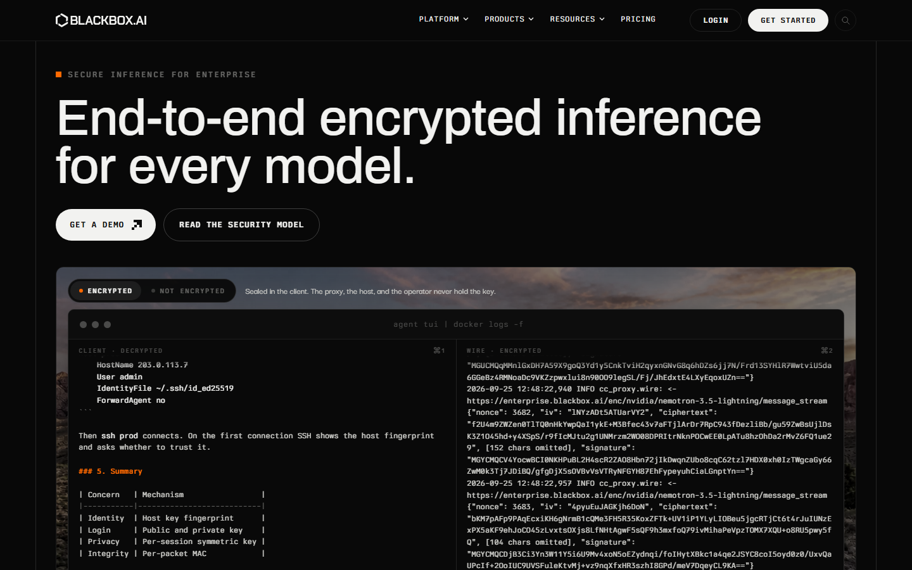
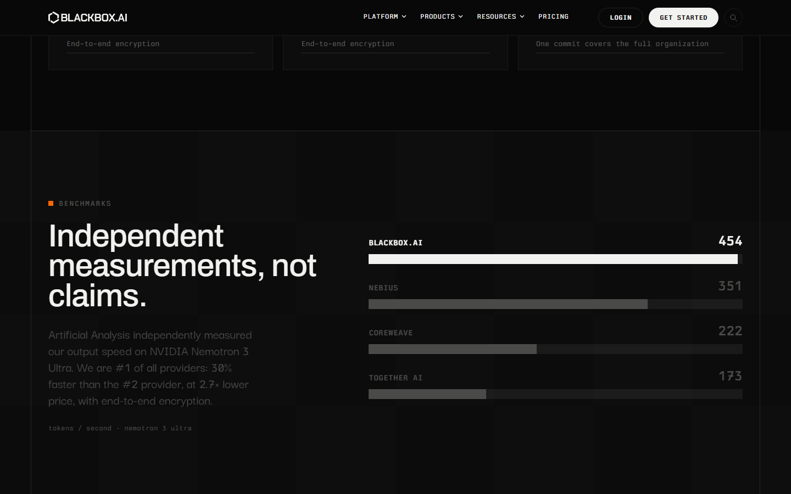
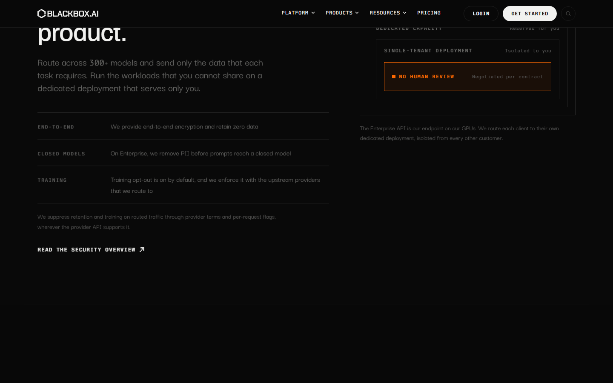
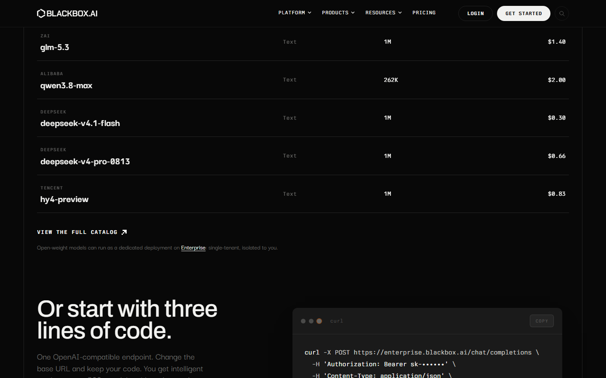
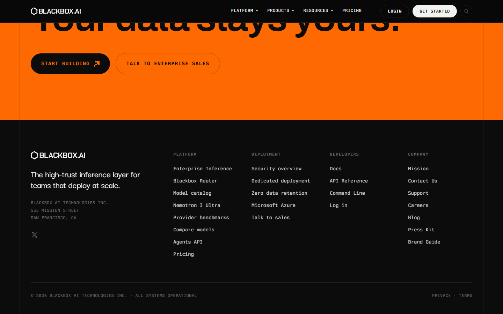

# Animation Reference

> Cinematic motion design extracted from live DOM. Follow these specs exactly to recreate the experience.

## Motion Technology Stack

| Library | Type | Notes |
|---------|------|-------|
| **Web Animations API (13 active)** | animation |  |

## Scroll Journey

The page is **7,237px** tall. Each frame below shows what the user sees at that scroll depth.

> **Use these screenshots to understand WHAT animates, WHEN it animates, and HOW it moves.**

### 0% — Top / Hero
Scroll position: 0px



### 17% — Opening Section
Scroll position: 1,077px


### 33% — First Feature Section
Scroll position: 2,091px



### 50% — Mid-Page
Scroll position: 3,169px



### 67% — Lower Content
Scroll position: 4,246px



### 83% — Near Footer
Scroll position: 5,260px


### 100% — Bottom / Footer
Scroll position: 6,337px



## CSS Keyframes (10 extracted)

### `@keyframes aetherisNavartBlink`

Duration: `1.1s` · Easing: `ease-in-out` · Delay: `0s` · Iteration: `infinite` · Fill: `none`

Used by: `.aetheris-mega-card:hover .aetheris-navart-blink, .aetheris-mega-hero:hover .bla`, `.aetheris-section-art.ax-art-inview .aetheris-navart-blink`, `.aetheris-isoladder:hover .aetheris-isoring-chip`

```css
@keyframes aetherisNavartBlink {
  0%, 100% {
    opacity: 1;
  }
  50% {
    opacity: 0.25;
  }
}
```

> Opacity fade

### `@keyframes riseIn`

Duration: `0.7s` · Easing: `cubic-bezier(0.22, 1, 0.36, 1)` · Delay: `var(--rise-delay,0s)` · Iteration: `1` · Fill: `backwards`

Used by: `html.ax-motion [data-rise][data-risen]`, `.aetheris-products-grid[data-reveal][data-shown] .aetheris-prod-card`

```css
@keyframes riseIn {
  0% {
    opacity: 0;
    transform: translateY(28px);
  }
  100% {
    opacity: 1;
    transform: translateY(0px);
  }
}
```

> Fade + motion enter animation

### `@keyframes cellIn`

Duration: `0.4s` · Easing: `ease` · Delay: `0.55s` · Iteration: `1` · Fill: `backwards`

Used by: `.aetheris-products-grid[data-reveal][data-shown] .aetheris-prod-dot`

```css
@keyframes cellIn {
  0% {
    opacity: 0;
    transform: scale(0.93);
  }
  100% {
    opacity: 1;
    transform: scale(1);
  }
}
```

> Fade + motion enter animation

### `@keyframes blink`

Duration: `1.1s` · Easing: `step-end` · Delay: `0s` · Iteration: `infinite` · Fill: `none`

Used by: `.aetheris-heroterm-cursor`

```css
@keyframes blink {
  0%, 50% {
    opacity: 1;
  }
  50.01%, 100% {
    opacity: 0;
  }
}
```

> Opacity fade

### `@keyframes aetherisSearchIn`

Duration: `0.22s` · Easing: `cubic-bezier(0.22, 1, 0.36, 1)` · Delay: `0s` · Iteration: `1` · Fill: `both`

Used by: `.aetheris-search-panel`

```css
@keyframes aetherisSearchIn {
  0% {
    opacity: 0;
    transform: translateY(-8px);
  }
  100% {
    opacity: 1;
    transform: translateY(0px);
  }
}
```

> Fade + motion enter animation

### `@keyframes aetherisSheetPanel`

Duration: `0.24s` · Easing: `cubic-bezier(0.22, 1, 0.36, 1)` · Delay: `0s` · Iteration: `1` · Fill: `backwards`

Used by: `.aetheris-msheet-panel`

```css
@keyframes aetherisSheetPanel {
  0% {
    opacity: 0;
    transform: translateY(-6px);
  }
  100% {
    opacity: 1;
    transform: translateY(0px);
  }
}
```

> Fade + motion enter animation

### `@keyframes pulse`

```css
@keyframes pulse {
  0% {
    box-shadow: rgba(255, 105, 1, 0.6) 0px 0px;
  }
  70% {
    box-shadow: rgba(255, 105, 1, 0) 0px 0px 0px 7px;
  }
  100% {
    box-shadow: rgba(255, 105, 1, 0) 0px 0px;
  }
}
```

> Shadow pulse/glow effect

### `@keyframes aetherisFade`

```css
@keyframes aetherisFade {
  0% {
    opacity: 0;
  }
  100% {
    opacity: 1;
  }
}
```

> Opacity fade

### `@keyframes aetherisNavartDash`

```css
@keyframes aetherisNavartDash {
  100% {
    stroke-dashoffset: var(--navart-travel,-12px);
  }
}
```

> SVG stroke animation

### `@keyframes enter`

```css
@keyframes enter {
  0% {
    opacity: var(--tw-enter-opacity,1);
    transform: translate3d(var(--tw-enter-translate-x,0),var(--tw-enter-translate-y,0),0)scale3d(var(--tw-enter-scale,1),var(--tw-enter-scale,1),var(--tw-enter-scale,1))rotate(var(--tw-enter-rotate,0));
    filter: blur(var(--tw-enter-blur,0));
  }
}
```

> Fade + motion enter animation · Filter effect (blur/brightness)

## Motion Tokens (CSS Variables)

### Duration Tokens

```css
--default-transition-duration: .15s;
```

### Easing Tokens

```css
--default-transition-timing-function: cubic-bezier(.4, 0, .2, 1);
--ease-out: cubic-bezier(0, 0, .2, 1);
```

### Delay Tokens

```css
--tw-animation-delay: 0s;
```

### Animation Tokens

```css
--tw-animation-direction: normal;
--tw-animation-iteration-count: 1;
--tw-animation-fill-mode: none;
```

## Global Transition Declarations

These `transition` values were extracted from CSS rules across the site:

```css
transition: opacity 0.18s, transform 0.18s;
transition: color 0.18s, background 0.18s;
transition: background 0.18s;
transition: opacity 0.9s ease-out;
transition: color 0.4s ease-in-out, background-size 0.4s ease-in-out;
transition: transform 0.25s;
transition: opacity 0.22s, transform 0.22s, visibility linear 0.22s;
transition: opacity 0.22s 0.15s, transform 0.22s 0.15s, visibility linear 0.15s;
transition: color 0.2s, border-color 0.2s;
transition: color 0.4s ease-in-out;
transition: background 0.2s, border-color 0.2s;
transition: color 0.2s;
```

## How to Recreate This Motion Design

### Step 1 — Install Dependencies

```bash
```

### Step 2 — Scroll-Reveal Pattern

Elements that animate into view follow this pattern:

```css
/* Initial hidden state */
.reveal {
  opacity: 0;
  transform: translateY(40px);
  transition: opacity .15s cubic-bezier(.4, 0, .2, 1),
              transform .15s cubic-bezier(.4, 0, .2, 1);
}
.reveal.visible {
  opacity: 1;
  transform: translateY(0);
}
```

### Step 3 — Key Motion Principles

- **Duration scale:** `.15s` · `0.18s` — use these values, never invent new durations
- **Always add** `@media (prefers-reduced-motion: reduce) { * { animation-duration: 0.01ms !important; transition-duration: 0.01ms !important; } }`

### Step 4 — Scroll Journey Reference

Match what happens at each scroll position:

- **0%** (`0px`) → `screens/scroll/scroll-000.png`
- **17%** (`1077px`) → `screens/scroll/scroll-017.png`
- **33%** (`2091px`) → `screens/scroll/scroll-033.png`
- **50%** (`3169px`) → `screens/scroll/scroll-050.png`
- **67%** (`4246px`) → `screens/scroll/scroll-067.png`
- **83%** (`5260px`) → `screens/scroll/scroll-083.png`
- **100%** (`6337px`) → `screens/scroll/scroll-100.png`

