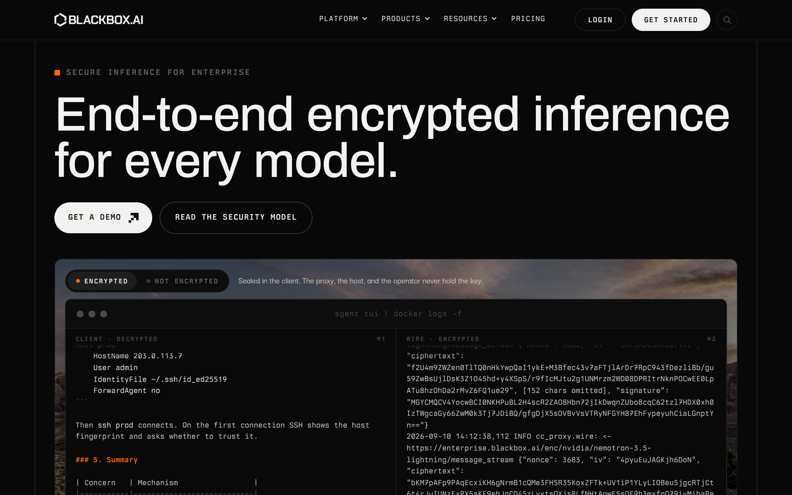

# aetheris DESIGN.md

> Auto-generated design system — reverse-engineered via static analysis by skillui.
> Frameworks: None detected
> Colors: 20 · Fonts: 3 · Components: 10
> Icon library: not detected · State: not detected
> Primary theme: light · Dark mode toggle: no · Motion: expressive

## Visual Reference

**Match this design exactly** — study colors, fonts, spacing, and component shapes before writing any UI code.



---

## 1. Visual Theme & Atmosphere

This is a **light-themed** interface with a warm, approachable feel. The light background emphasizes content clarity. Typography pairs **darkerGrotesque** for display/headings with **archivo** for body text, creating clear visual hierarchy through type contrast. Spacing follows a **4px base grid** (compact density), with scale: 2, 4, 6, 8, 10, 12, 14, 16px. The accent color **#ff691f** anchors interactive elements (buttons, links, focus rings). Motion is expressive — spring physics, layout animations, and staggered reveals are part of the visual language.

---

## 2. Color Palette & Roles

| Token | Hex | Role | Use |
|---|---|---|---|
| tw-ring-offset-color | `#ffffff` | background | Page background, darkest surface |
| foreground | `#f2f2f0` | surface | Card and panel backgrounds |
| card | `#1a1a1a` | surface | Card and panel backgrounds |
| color-black | `#080808` | text-primary | Headings and body text |
| text-muted | `#666664` | text-muted | Captions, placeholders, secondary info |
| border | `#4a4a49` | border | Dividers, card borders, outlines |
| primary | `#ff691f` | accent | CTAs, links, focus rings, active states |
| color-orange-500 | `#ff6901` | danger | Error states, destructive actions |
| color-emerald-500 | `#00bb7f` | success | Success states, positive indicators |
| color-amber-500 | `#f99c00` | warning | Warning states, caution indicators |
| color-sky-500 | `#00a5ef` | info | Informational highlights |
| unknown | `#cfcfcb` | unknown | Palette color |
| unknown | `#c4c4c0` | unknown | Palette color |
| unknown | `#585857` | unknown | Palette color |
| unknown | `#1f2326` | unknown | Palette color |
| unknown | `#dededb` | unknown | Palette color |
| color-red-400 | `#ff6568` | unknown | Palette color |
| primary-foreground | `#190f0b` | unknown | Palette color |
| color-orange-400 | `#ff8b1a` | unknown | Palette color |
| unknown | `#d73a49` | unknown | Palette color |

### CSS Variable Tokens

```css
--tw-border-style: solid;
--tw-border-style: dashed;
--background: #070707;
--foreground: #f5f5f5;
--card: #161616;
--card-foreground: #f5f5f5;
--popover: #161616;
--popover-foreground: #f5f5f5;
--primary: #ff691f;
--primary-foreground: #190f0b;
--secondary: #222;
--secondary-foreground: #f5f5f5;
--muted: #222;
--muted-foreground: #9e9e9e;
--accent: #222;
--accent-foreground: #f5f5f5;
--destructive: #ff6568;
--border: #ffffff1f;
--sidebar-foreground: #f5f5f5;
--sidebar-primary: #ff691f;
```


---

## 3. Typography Rules

**Font Stack:**
- **archivo** — Heading 1, Heading 2, Heading 3
- **darkerGrotesque** — Body, Caption
- **berkeleyMono** — Code

**Font Sources:**

```css
@font-face {
  font-family: "darkerGrotesque";
  src: url("fonts/darkerGrotesque-500.woff2") format("woff2");
  font-weight: 500;
}
@font-face {
  font-family: "archivo";
  src: url("fonts/archivo-500.woff2") format("woff2");
  font-weight: 500;
}
@font-face {
  font-family: "berkeleyMono";
  src: url("fonts/berkeleyMono-Regular.woff2") format("woff2");
  font-weight: 400;
}
@font-face {
  font-family: "berkeleyMono";
  src: url("fonts/berkeleyMono-700.woff2") format("woff2");
  font-weight: 700;
}
@font-face {
  font-family: "berkeleyMonoNumerals";
  src: url("fonts/berkeleyMonoNumerals-Regular.woff2") format("woff2");
  font-weight: 400;
}
@font-face {
  font-family: "berkeleyMonoNumerals";
  src: url("fonts/berkeleyMonoNumerals-700.woff2") format("woff2");
  font-weight: 700;
}
@font-face {
  font-family: "berkeleyMonoNumeralsDisplay";
  src: url("fonts/berkeleyMonoNumeralsDisplay-Regular.woff2") format("woff2");
  font-weight: 400;
}
@font-face {
  font-family: "berkeleyMonoNumeralsDisplay";
  src: url("fonts/berkeleyMonoNumeralsDisplay-700.woff2") format("woff2");
  font-weight: 700;
}
```

| Role | Font | Size | Weight |
|---|---|---|---|
| Heading 1 | archivo | 2.5rem | 700 |
| Heading 2 | archivo | 2.375rem | 700 |
| Heading 3 | archivo | clamp(2rem,7.1cqw,5rem) | 700 |
| Body | darkerGrotesque | .6875rem | 400 |
| Caption | darkerGrotesque | 11px | 400 |
| Code | berkeleyMono | 14px | 400 |

**Typographic Rules:**
- Limit to 3 font families max per screen
- Use **archivo** for body/UI text, **darkerGrotesque** for display/headings
- Maintain consistent hierarchy: no more than 3-4 font sizes per screen
- Headings use bold (600-700), body uses regular (400)
- Line height: 1.5 for body text, 1.2 for headings
- Use color and opacity for secondary hierarchy, not additional font sizes


---

## 4. Component Stylings

### Layout (1)

**Footer** — `html`

### Navigation (1)

**Navigation** — `html`

### Data Display (3)

**Card** — `html`
- Variants: `motif`, `motif-compact`

**Badge** — `html`

**List** — `html`

### Data Input (2)

**Button** — `html`
- Animation: 

**Input** — `html`
- State: :focus, :placeholder

### Media (3)

**Image** — `html`

**Icon** — `html`

**Map/Canvas** — `html`


---

## 5. Layout Principles

- **Base spacing unit:** 4px
- **Spacing scale:** 2, 4, 6, 8, 10, 12, 14, 16, 18, 20, 22, 24
- **Border radius:** .25rem, 6px, 10px, 12px, 999px, 999rem
- **Max content width:** 1024px

**Spacing as Meaning:**
| Spacing | Use |
|---|---|
| 4-8px | Tight: related items within a group |
| 12-16px | Medium: between groups |
| 24-32px | Wide: between sections |
| 48px+ | Vast: major section breaks |


---

## 6. Depth & Elevation

### Flat — subtle depth hints

- `inset 0 1px 2px #0006`

### Raised — cards, buttons, interactive elements

- `0 0#ff690199`
- `0 0 0 7px #ff690100`
- `0 0#ff690100`

### Overlay — full-screen overlays, top-level dialogs

- `0 30px 70px -20px #000c`
- `0 0 30px #ff690121`
- `0 24px 60px #00000080`

### Z-Index Scale

`5, 10, 50, 80, 120, 150, 200`


---

## 7. Animation & Motion

This project uses **expressive motion**. Animations are an integral part of the experience.

### CSS Animations

- `@keyframes cellIn`
- `@keyframes riseIn`
- `@keyframes pulse`
- `@keyframes aetherisFade`
- `@keyframes blink`
- `@keyframes aetherisNavartDash`
- `@keyframes aetherisNavartBlink`
- `@keyframes aetherisSearchIn`

### Animated Components

- **Button**: 

### Motion Guidelines

- Duration: 150-300ms for micro-interactions, 300-500ms for page transitions
- Easing: `ease-out` for enters, `ease-in` for exits
- Always respect `prefers-reduced-motion`


---

## 8. Do's and Don'ts

### Do's

- Use `#ff691f` for interactive elements (buttons, links, focus rings)
- Use `#ffffff` as the primary page background
- Pair **archivo** (body) with **darkerGrotesque** (display) — these are the only allowed fonts
- Follow the **4px** spacing grid for all margins, padding, and gaps
- Use the defined shadow tokens for elevation — see Section 6
- Use border-radius from the scale: .25rem, 6px, 10px, 12px, 999px
- Reuse existing components from Section 4 before creating new ones

### Don'ts

- Don't introduce colors outside this palette — extend the design tokens first
- Don't introduce additional font families beyond archivo and darkerGrotesque and berkeleyMono
- Don't use arbitrary spacing values — stick to multiples of 4px
- Don't create custom box-shadow values outside the system tokens
- Don't use arbitrary border-radius values — pick from the defined scale
- Don't duplicate component patterns — check Section 4 first
- Don't use backdrop-blur or blur effects

### Anti-Patterns (detected from codebase)

- No blur or backdrop-blur effects
- No zebra striping on tables/lists


---

## 9. Responsive Behavior

| Name | Value | Source |
|---|---|---|
| xs | 22.5rem | css |
| sm | 40rem | css |
| md | 48rem | css |
| lg | 56.3125rem | css |
| lg | 64rem | css |
| xl | 80rem | css |
| 2xl | 96rem | css |
| 2xl | 100rem | css |
| sm | 620px | css |
| sm | 640px | css |
| md | 768px | css |
| lg | 900px | css |
| lg | 1000px | css |
| lg | 1024px | css |
| xl | 1080px | css |
| xl | 1100px | css |
| xl | 1200px | css |

**Approach:** Use `@media (min-width: ...)` queries matching the breakpoints above.


---

## 10. Agent Prompt Guide

Use these as starting points when building new UI:

### Build a Card

```
Background: #f2f2f0
Border: 1px solid #4a4a49
Radius: 12px
Padding: 16px
Font: archivo
Use shadow tokens from Section 6.
```

### Build a Button

```
Primary: bg #ff691f, text white
Ghost: bg transparent, border #4a4a49
Padding: 8px 16px
Radius: 12px
Hover: opacity 0.9 or lighter shade
Focus: ring with #ff691f
```

### Build a Page Layout

```
Background: #ffffff
Max-width: 1024px, centered
Grid: 4px base
Responsive: mobile-first, breakpoints from Section 9
```

### Build a Stats Card

```
Surface: #f2f2f0
Label: #666664 (muted, 12px, uppercase)
Value: #080808 (primary, 24-32px, bold)
Status: use success/warning/danger from Section 2
```

### Build a Form

```
Input bg: #ffffff
Input border: 1px solid #4a4a49
Focus: border-color #ff691f
Label: #666664 12px
Spacing: 16px between fields
Radius: 12px
```

### General Component

```
1. Read DESIGN.md Sections 2-6 for tokens
2. Colors: only from palette
3. Font: archivo, type scale from Section 3
4. Spacing: 4px grid
5. Components: match patterns from Section 4
6. Elevation: shadow tokens
```
