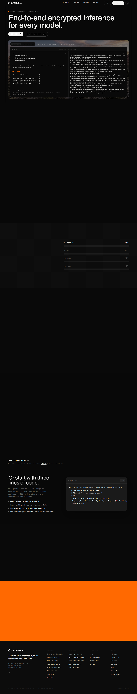
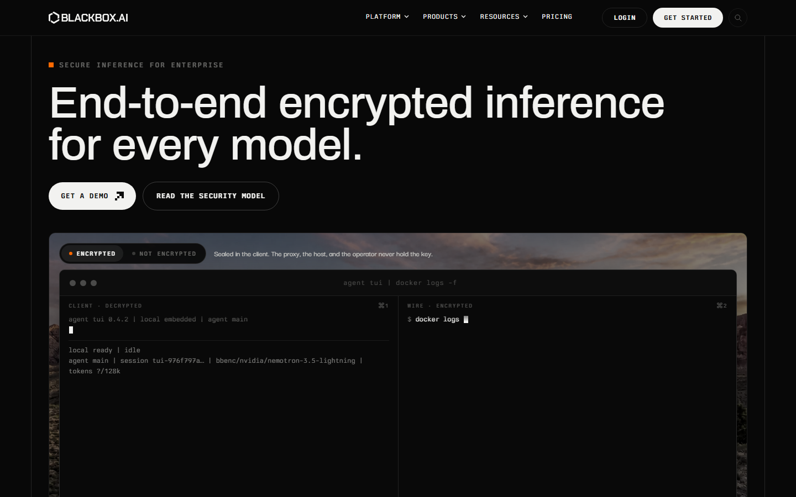
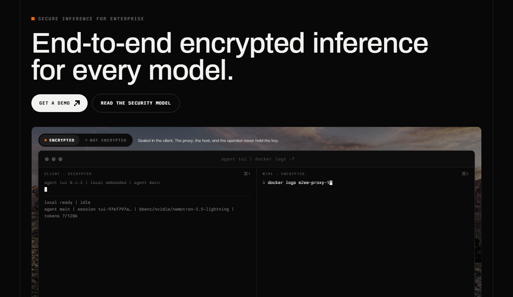
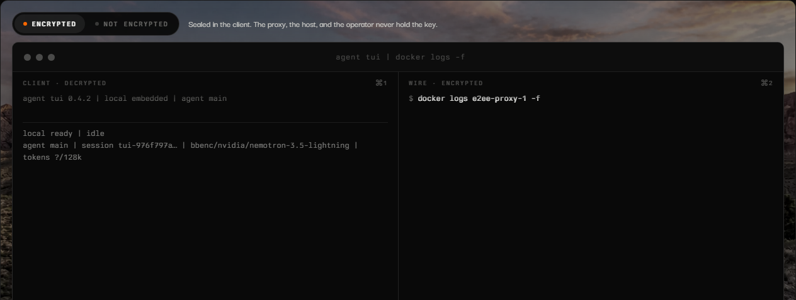

# aetheris — Visual Guide

> Master visual reference. Study every screenshot carefully before implementing any UI.
> Match colors, layout, typography, spacing, and motion states exactly.

**Motion Stack:** **Web Animations API (13 active)**

## Scroll Journey

The page has cinematic scroll animations. Each screenshot below shows the exact visual state at that scroll depth.
**Replicate these transitions precisely** — the design changes dramatically as you scroll.

### Hero — Above the fold

*Scroll position: 0px of 7237px total*

### 17% scroll depth

*Scroll position: 1077px of 7237px total*

### 33% scroll depth

*Scroll position: 2091px of 7237px total*

### 50% scroll depth

*Scroll position: 3169px of 7237px total*

### 67% scroll depth

*Scroll position: 4246px of 7237px total*

### 83% scroll depth

*Scroll position: 5260px of 7237px total*

### Footer — End of page

*Scroll position: 6337px of 7237px total*

## Full Page Screenshots

### Aetheris: The high-trust platform for frontier inference

*URL: `https://aetheris.dev/`*

## Section Screenshots

Clipped sections showing individual components in context.

### Section 1 — `section`

*1440×1069px*

### Section 9 — `[class*="hero"]`

*1440×1004px*

### Section 10 — `[class*="hero"]`

*1264×608px*

